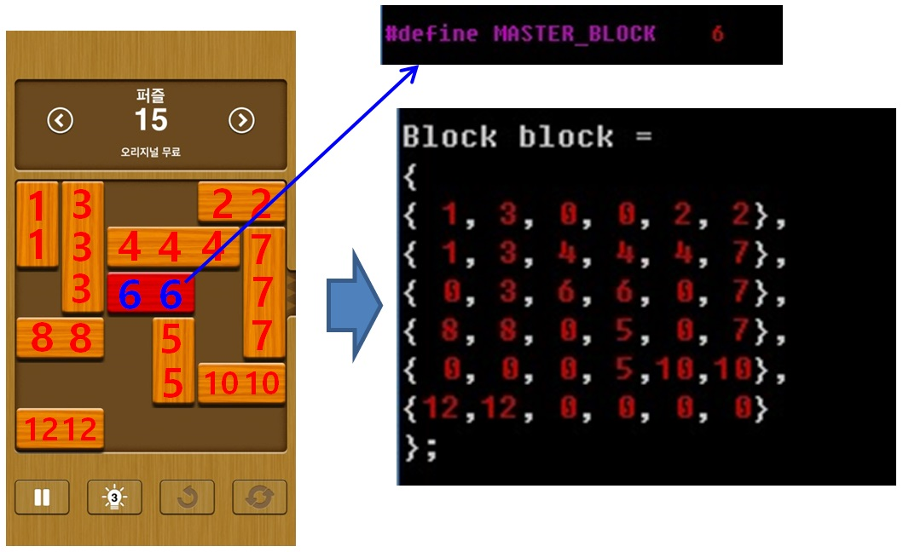

# Unblockme Solution

Author : LEE Ho Sang  
E-Mail : hahaite@hanmail.net  
Site : http://hahaite.tistory.com/273 (Korean)

Language : C++  
Test OS : Ubuntu 14.04

### License
- This software is FREE and No Warranty.
- Everyone uses this software without any restrictions.

Who uses this software? :)

### description
In main.cpp, can find MASTER_BLOCK and array Block.
And set values as below image.

after compile and execute,  
 $ make  
 $ ./main  
you can see result and move block as result.

Thanks to see my poor software. :)
